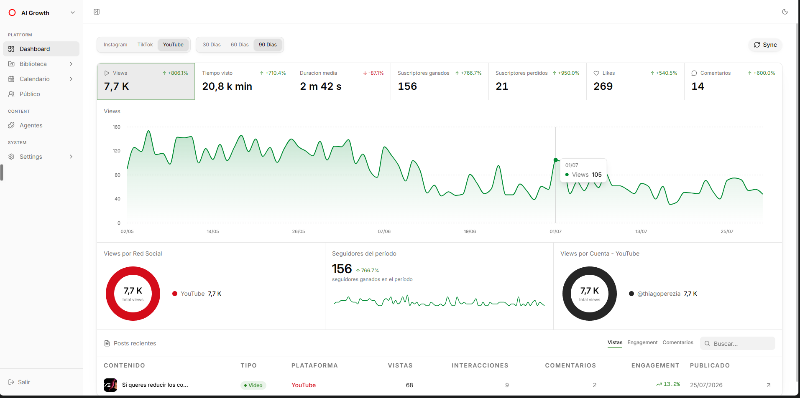
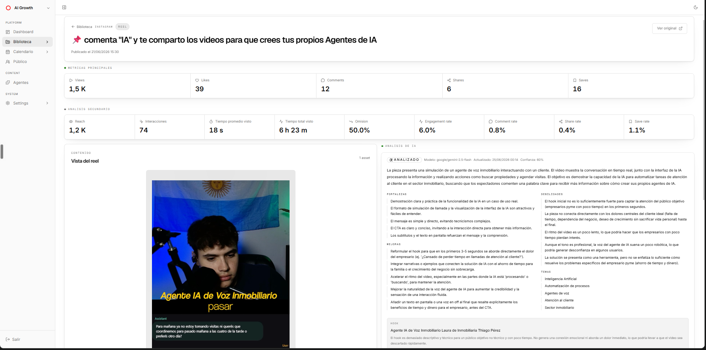
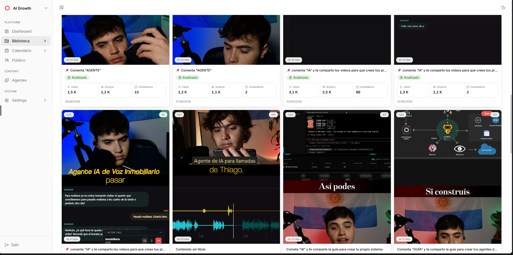
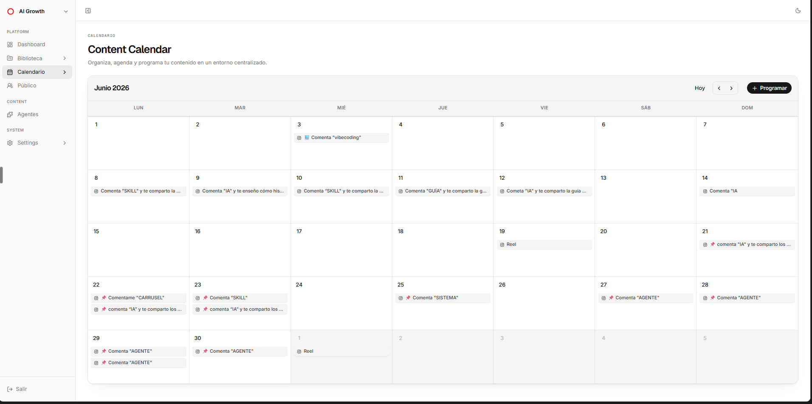

# ContentOS

A self-hosted workspace for the social accounts you own. It connects Instagram,
TikTok and YouTube over OAuth, syncs your content and metrics into your own
Supabase project, transcribes and analyses posts with an LLM, and exposes a
read-only MCP server so external agents can query the result.

Everything runs on infrastructure you control: your content, your database, your
API keys.



*The dashboard on a live deployment, filtered to YouTube over 90 days. The name
in the sidebar comes from `NEXT_PUBLIC_APP_NAME` — yours will show whatever you
set, defaulting to "Acme".*

> **This is a single-user application.** One deployment serves one authorised
> person. It is not multi-tenant and does not isolate data between users — read
> [Limitations](#limitations) before you plan around it.

**New here?** [docs/SETUP.md](docs/SETUP.md) is the step-by-step guide from empty
clone to connected accounts — written to be followed by a person or executed by
an AI agent.

## Contents

- [What it does](#what-it-does)
- [Stack](#stack)
- [Setup](#setup)
- [Running it](#running-it)
- [Syncing data](#syncing-data)
- [The MCP server](#the-mcp-server)
- [Deploying](#deploying)
- [Project layout](#project-layout)
- [Testing](#testing)
- [Limitations](#limitations)
- [Contributing](#contributing)
- [License](#license)

## What it does

- **Connects accounts** — Instagram, TikTok and YouTube via OAuth. Tokens are
  encrypted at rest using `CONNECTION_ENCRYPTION_SECRET`.
- **Syncs content and metrics** — posts, captions, engagement, follower counts
  and audience demographics land in your Supabase project and stay there.
  Metrics are stored as timestamped snapshots rather than overwritten, so trends
  survive.
- **Transcribes and analyses** — reels get transcribed and posts scored by an LLM
  through OpenRouter, against a per-account strategic brief so the output is
  about your business rather than generic advice.
- **Dashboard, library, audience** — aggregate metrics and trends, a filterable
  content library with per-post detail, and demographic breakdowns.
- **Read-only MCP server** — external agents authenticate over OAuth and query
  briefs, metrics, analyses and transcripts. Never raw payloads or credentials.

### The analysis is the point



*Every piece gets scored against the account's strategic brief. Strengths and
weaknesses on the left, specific rewrites on the right — including a critique of
the hook itself. The model and confidence are shown so you can judge the verdict,
and the raw payload is kept so a better model can re-read it later.*

This is what separates ContentOS from a metrics dashboard. Numbers tell you a
post underperformed; this tells you the hook was too descriptive for a
time-poor audience and suggests what to say instead.

### Library and calendar



*Everything synced, filterable by platform, account and status. The green
"Analizado" badge marks pieces the AI has already processed — the cost guards
read that state to avoid paying twice.*



*A month view of what went out and what is scheduled. Publishing is simulated
today — see [Limitations](#limitations).*

## Stack

| Layer | Choice |
|---|---|
| Framework | Next.js 16 (App Router), React 19, TypeScript |
| Styling | Tailwind CSS v4 (`@import "tailwindcss"`, no config file) |
| Database & auth | Supabase (Postgres + pgvector + Auth) |
| Cache / rate limiting | Upstash Redis (optional) |
| LLM | OpenRouter |
| Tracing | Langfuse (optional) |
| Runtime | Node.js — no Edge runtime |

## Setup

> **→ [docs/SETUP.md](docs/SETUP.md) is the full walkthrough**, written for both
> humans and AI agents: every value spelled out, every phase ending in a check
> you can run. Start there. What follows is the short version so you know what
> you're getting into.

### Requirements

| Thing | Required | Notes |
|---|---|---|
| Node.js 24+, pnpm 11 | Yes | `.nvmrc` pins the major |
| A Supabase project | Yes | Free tier is fine |
| An OpenRouter key | For AI features | Metrics sync without it |
| Your own platform developer apps | Per platform you connect | See below |
| A domain with HTTPS | For production | OAuth callbacks require it |

### The short version

```bash
corepack enable
pnpm install --frozen-lockfile
cp .env.example .env.local
```

1. Create a Supabase project and run `supabase/run_all_migrations.sql` in the SQL
   Editor. It provisions all 21 migrations, including the row-level security
   lockdown. **Do not cherry-pick** — your `anon` key ships to every browser, and
   skipping the RLS migration leaves the database readable by anyone.
2. Disable public signup in Supabase Auth, create your single user, copy their
   user ID into `ALLOWED_USER_ID`.
3. Fill the Supabase keys, `AUTH_SECRET`, `CONNECTION_ENCRYPTION_SECRET` and
   `ALLOWED_USER_EMAIL` in `.env.local`.
4. `pnpm dev` → sign in at `/login` → empty dashboard. That's a working install.

Connecting accounts is a separate, slower job. `src/lib/env.ts` is the
authoritative schema for everything else.

### The part that takes real time

**Each deployment needs its own developer apps.** Credentials can't be shared
between installs, and each platform reviews your app before granting production
scopes — days to weeks, none of it under this project's control. Everything else
above takes about an hour.

| Platform | Flow this app uses | The usual blocker |
|---|---|---|
| Instagram | **Instagram Login**, not Facebook Login — `instagram_business_basic`, `instagram_business_manage_insights` | Using the Facebook App ID instead of the **Instagram** App ID, and forgetting to accept the tester invite from inside Instagram |
| TikTok | Login Kit with PKCE — `user.info.basic`, `user.info.profile`, `user.info.stats`, `video.list` | `video.list` needs manual review, and without it you get an account with no content. The env var is `TIKTOK_CLIENT_KEY`, not a client ID |
| YouTube | Google OAuth — `youtube.readonly`, `yt-analytics.readonly` | Two hard failures enforced in code: no refresh token (revoke and reconnect), and the Google identity must own **exactly one** channel. In Testing mode Google expires refresh tokens after **7 days** |

Redirect URI is always `<APP_URL>/api/oauth/<platform>/callback`.

You can run the app with none of these configured — it simply has no accounts to
sync. [docs/SETUP.md](docs/SETUP.md) covers each platform step by step, with
troubleshooting tables for the errors these consoles actually produce.

### Optional services

| Service | Purpose | Without it |
|---|---|---|
| OpenRouter | Transcription and content analysis | No AI features; metrics still sync |
| Upstash Redis | Caching and rate limiting | No rate limiting on serverless |
| Langfuse | LLM tracing and cost tracking | No traces |
| Apify | Competitor scraping | Competitor module unavailable |
| OpusClip | Clip generation | Clip automations unavailable |

## Running it

```bash
pnpm dev          # dev server
pnpm dev:https    # dev over HTTPS, needed for some OAuth callbacks
pnpm build        # production build
pnpm start        # serve the production build
```

Sign in at `/login` with the Supabase user you authorised.

## Syncing data

```bash
pnpm sync:run         # full sync: content, metrics, transcription, analysis
pnpm sync:dashboard   # metrics only
pnpm sync:ai          # backfill AI analysis over existing content
```

A daily cron is declared in `vercel.json` hitting `/api/sync/cron`, protected by
`CRON_SECRET`. On Windows, `pnpm task:register` registers an equivalent local
scheduled task.

The pipeline persists content before attempting AI work, so a failing model
never costs you the sync.

### A note on AI cost

Every sync walks all content from `BACKFILL_START_ISO` — set it to roughly when
your account started producing content worth analysing, or you will pay to walk
years you do not care about. Guards in `src/lib/content-analysis-agent.ts` and
`src/lib/reel-transcription.ts` are the only thing preventing you from re-paying
OpenRouter for content you already processed:

- Content with an existing insight marked `ready` or `fallback` is reused, not
  re-analysed.
- Failed work gets a 24-hour cooldown and at most five attempts.

To verify the guards hold, run `pnpm sync:run` twice. The second pass must report
`analysis.attempted: 0` and `transcription.attempted: 0`. **Do not loosen these
without measuring what it costs you.**

## The MCP server

A read-only Model Context Protocol server is published at
`https://<your-domain>/mcp`, letting external agents query your content without
touching raw payloads, private media or platform credentials. Every call is
audited into `mcp_audit_events`.

Setup and the full tool list are in [MCP.md](MCP.md).

## Deploying

Built for Vercel, though nothing stops it running anywhere Node.js does.

- Framework: Next.js · Root directory: `/`
- Install: `pnpm install --frozen-lockfile` · Build: `pnpm build`

Before going live:

1. Apply all migrations.
2. Confirm public signup is disabled in Supabase Auth.
3. Confirm `ALLOWED_USER_ID` / `ALLOWED_USER_EMAIL` point at the right user.
4. Set `APP_URL` to the final domain — origin checks on mutations depend on it.
5. Configure Upstash if you want real rate limiting on serverless.
6. Register the OAuth redirect URIs against the production domain.

## Project layout

```
src/
  app/
    dashboard/  audience/  content/  agents/  calendar/  account/
    api/
      oauth/    # per-platform OAuth start and callback
      sync/     # sync endpoints and cron
      agents/   # analysis and transcription settings
  components/
    app-shell.tsx        # sidebar + header layout
  lib/
    mcp/                 # MCP server and read-only DTOs
    supabase/            # repository pattern: queries and mappers
    sync/                # per-platform sync pipeline
    env.ts               # environment validation (Zod)
    branding.ts          # configurable display name
  proxy.ts               # auth middleware (Next 16 renamed middleware.ts)
supabase/
  migrations/            # source of truth for the schema
  run_all_migrations.sql # generated bundle — pnpm db:bundle
```

Further reading:

- [docs/SETUP.md](docs/SETUP.md) — full setup walkthrough, per platform, with
  verification checkpoints and troubleshooting
- [docs/DATABASE.md](docs/DATABASE.md) — schema reference: the tables, the
  security model, and how to change it safely
- [docs/ARCHITECTURE.es.md](docs/ARCHITECTURE.es.md) — full architecture, data
  model, security layers and the reasoning behind each decision (Spanish)
- [CLAUDE.md](CLAUDE.md) — conventions and gotchas for contributors
- [AGENTS.md](AGENTS.md) — contract for AI agents working on this repo
- [plans/](plans/) — implementation backlog

Two Spanish guides describe how to build something like this **elsewhere**, not
how this repository works — useful as blueprints, but do not read them as a
reference for the current code:

- [GUIA_CONTENT_OS.md](GUIA_CONTENT_OS.md) — building a comparable content OS
  from scratch, aimed at non-programmers and at AI coding agents. It describes a
  superset of this project, including an in-app chat assistant that ContentOS
  removed in favour of the MCP server
- [GUIA_DISENO_SHADCN.md](GUIA_DISENO_SHADCN.md) — porting this design system to
  another project

## Testing

```bash
pnpm typecheck   # tsc --noEmit — silence means success
pnpm test        # vitest with coverage
pnpm lint        # eslint
```

CI runs all three plus a production build on every push. Tests cover metrics
aggregation, dashboard ranges, media parsing, transcription, Supabase mappers,
competition and agent settings — solid on business logic, no end-to-end suite.

## Limitations

Stated plainly, so you can judge the fit before investing in setup:

- **Single user, by design.** Access is an allowlist of exactly one Supabase user.
  There is no per-user data ownership and no workspace model. Supporting a second
  user means adding `user_id` to every table and rewriting the RLS policies. Do
  not connect other people's accounts to a shared instance.
- **Platform APIs move.** Instagram, TikTok and YouTube change scopes, deprecate
  fields and revise review requirements on their own schedule. The sync adapters
  need ongoing maintenance.
- **AI costs real money.** Analysis and transcription bill per item. Read the cost
  section above before your first full sync.
- **`calendar/publish` simulates publishing.** It validates the scheduling flow;
  it does not post to any platform yet.
- **Competition and automations are ahead in the schema.** Backend and tables are
  further along than the exposed UI.
- **CSP is report-only.** Deliberately, as a first step — not yet enforcing.
- **Docs are mixed-language.** This README is English; the in-depth guides are
  Spanish.

## Contributing

Issues and pull requests are welcome. See [CONTRIBUTING.md](CONTRIBUTING.md) for
the workflow, and [SECURITY.md](SECURITY.md) for reporting vulnerabilities
privately rather than in a public issue.

## License

Apache License 2.0 — see [LICENSE](LICENSE) and [NOTICE](NOTICE).

The licence covers the source. It grants no rights to any deployer's name or
logo, and it does not cover the third-party services ContentOS talks to; you are
responsible for your own credentials and for complying with each platform's
terms.
